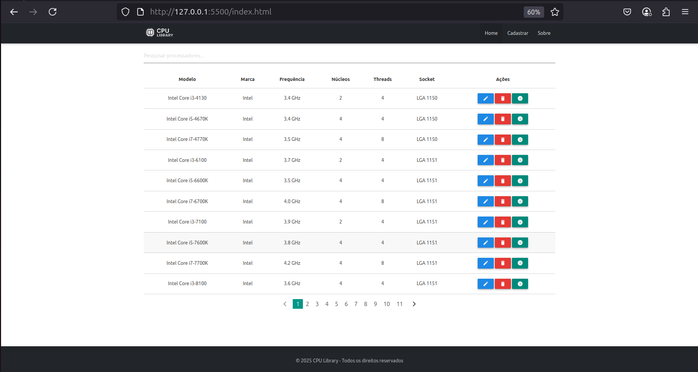
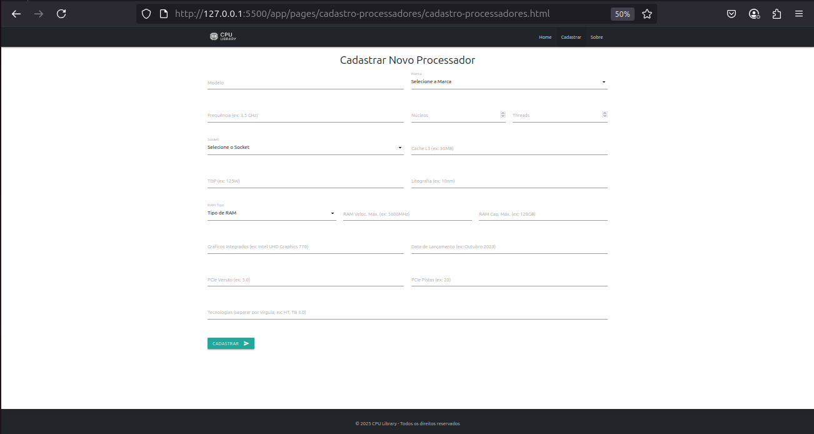
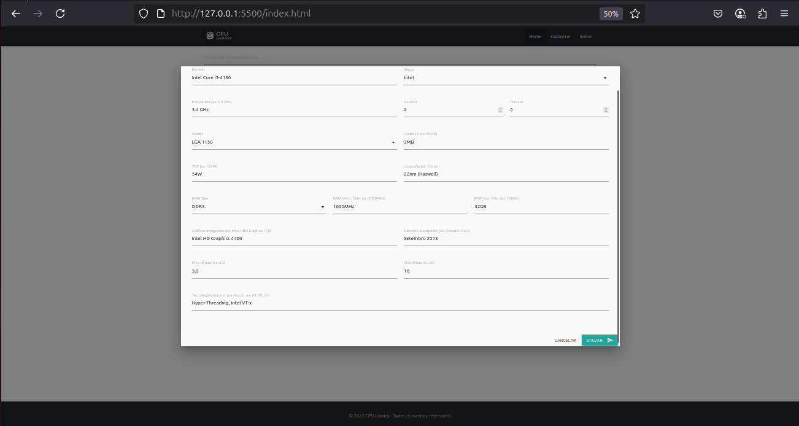
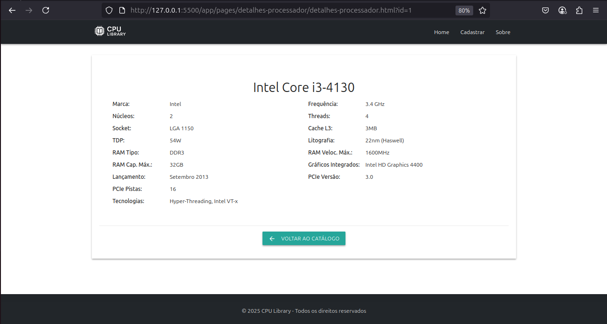
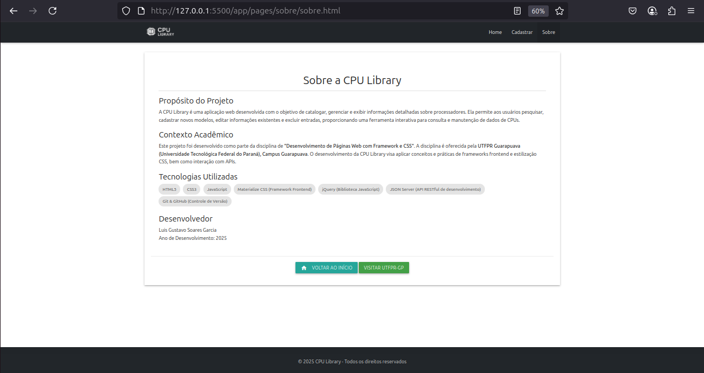

# CPU Library: Gerenciador de Processadores

## Identificação/Autor
* **Nome Completo:** Luis Gustavo Soarea Garcia
* **Link GitHub:** https://github.com/luisg-sgarcia

## Descrição do Projeto
A CPU Library é uma aplicação web interativa desenvolvida para catalogar e gerenciar informações sobre processadores de computador (CPUs). A ferramenta permite aos usuários:
* **Visualizar uma lista paginada de processadores:** Exibindo informações essenciais como modelo, marca, frequência, núcleos, threads e socket.
* **Pesquisar e filtrar processadores:** Encontrando rapidamente modelos específicos na lista.
* **Cadastrar novos processadores:** Inserindo detalhes completos como cache, TDP, litografia, informações de RAM, gráficos integrados, data de lançamento e tecnologias.
* **Editar informações de processadores existentes:** Atualizando quaisquer detalhes através de um modal de edição completo.
* **Excluir processadores:** Com uma confirmação de segurança via modal Materialize.
* **Visualizar detalhes completos de um processador:** Abrindo uma página dedicada com todas as especificações ao clicar em um item da lista.
* **Navegação responsiva:** O menu se adapta a dispositivos móveis com um `sidenav`.

## Contexto Acadêmico
Este projeto foi desenvolvido como parte da disciplina de **"Desenvolvimento de Páginas Web com Framework e CSS"** da **UTFPR Guarapuava (Universidade Tecnológica Federal do Paraná), Campus Guarapuava**. O objetivo principal foi aplicar e demonstrar o domínio de frameworks frontend, manipulação do DOM, requisições assíncronas a APIs e boas práticas de desenvolvimento web.

## Prototipação no Figma
* **Link para o Protótipo no Figma:** [Ainda não feito. O projeto Figma terá as páginas: Design-System, Desktop e Mobile.]

## Design System
Este projeto segue as diretrizes do **Material Design**, implementado através do **Materialize CSS**.
* **Paleta de Cores:**
    * Principal: `#212529` (preto/cinza escuro) para Navbar e Footer.
    * Destaque: `teal` (azul-esverdeado) para paginação ativa e alguns botões.
    * Padrões de erro/sucesso/alerta do Materialize (red darken-2, green darken-2, orange darken-2).
* **Tipografia:** Padrões do Material Design/Materialize, com ajustes responsivos utilizando `clamp()` para títulos.
* **Componentes:** Utiliza amplamente os componentes visuais e interativos oferecidos pelo Materialize CSS (cards, botões, modais, sidenav, toasts, inputs, selects, paginação).
* **Link para o Documento de Design System (Opcional, se criado separadamente):** [N/A, ou cole o link se criar um documento dedicado]

## Framework CSS
* **Nome do Framework:** Materialize CSS

## Dependências
* **jQuery:** Utilizado para manipulação simplificada do DOM, tratamento de eventos e requisições AJAX.

## Link para o Site em Produção (GitHub Pages)
* **URL da Aplicação Publicada:** https://luisg-sgarcia.github.io/cpu-library/

## Checklist de Funcionalidades (Indicadores de Desempenho - IDs)

Esta seção detalha as funcionalidades implementadas conforme os Resultados de Aprendizagem (RA) e Indicadores de Desempenho (ID) definidos na disciplina.

**RA1 - Utilizar Frameworks CSS para estilização de elementos HTML e criação de layouts responsivos.**
* [ ] ID 00 - Prototipa interfaces adaptáveis para no mínimo os tamanhos de tela mobile e desktop, usando ferramentas de design como Figma, Quant UX ou Sketch.
* [x] ID 01 - Implementa um layout responsivo de uma página web utilizando um Framework CSS, como Bootstrap, Materialize ou Tailwind (com DaisyUI), aproveitando as técnicas de Flexbox ou Grid oferecidas pelo próprio framework, garantindo que o layout se adapte adequadamente a diferentes tamanhos de tela e dispositivos.
* [x] ID 02 - Utiliza técnica de responsividade nativa de CSS, como Flexbox ou Grid Layout, para criar layouts responsivos e fluidos em diferentes resoluções de tela.
* [x] ID 03 - Utiliza componentes CSS (ex. card, button ou outros) e JavaScript (ex. modal, carrousel ou outro) oferecidos por um Framework CSS.
* [x] ID 04 - Implementa um layout fluido e responsivo utilizando unidades relativas (vw, vh, %, em ou rem) em vez de unidades fixas (px) em diferentes dispositivos e tamanhos de tela.
* [x] ID 05 - Implementa animações em elementos da página, como fadeIn/fadeOut, slideIn/slideOut, utilizando CSS Animations ou bibliotecas de animação, como o Animate.css ou JQuery, para fornecer feedback visual ao usuário e criar uma experiência interativa.
* [x] ID 06 - Cria transições personalizadas entre diferentes estados da página ou elementos, como mudanças de layout, alterações de cor ou exibição/hide de elementos, usando CSS Transitions ou CSS Animation, para melhorar a usabilidade e a aparência da aplicação.
* [ ] ID 07 - Aplica um Design System consistente, definindo diretrizes de estilo, cores, tipografia e padrões de componentes que são seguidos em toda a aplicação, garantindo uma experiência de usuário uniforme e atraente.
* [ ] ID 08 - Implementa pré-processadores CSS, como o Sass, em conjunto com um Framework CSS ou de forma isolada, para organizar e modularizar o código CSS, aplicando variáveis, mixins e funções para facilitar a manutenção e escalabilidade dos estilos.
* [x] ID 09 - Aplica tipografia responsiva utilizando media queries ou a função clamp(), em conjunto com unidades relativas como rem, em ou vw, para ajustar o tamanho da fonte de acordo com diferentes tamanhos de tela.
* [x] ID 10 – Aplica técnicas de responsividade de imagens usando CSS, como object-fit e containers com unidades relativas (vh, %, rem) para uniformizar tamanhos, garantindo boa exibição em diferentes tamanhos de tela.
* [ ] ID 11 – Otimiza imagens com uso de formatos modernos como WebP e carregamento adaptativo, utilizando atributos como srcset, elemento <picture> ou URLs do Cloudinary com parâmetros como w_, h_, f_auto e q_auto.

**RA2 - Realizar tratamento de formulários e aplicar validações customizadas no lado cliente, utilizando a API do HTML e expressões regulares (REGEX).**
* [x] ID 12 - Implementa tratamento de formulários no lado cliente com apresentação de mensagens de erro (texto próximo dos campos de entrada ou balões com mensagens) ou sucesso, utilizando os recursos da API do HTML, como validação de campos obrigatórios, tipo de entrada e limites de caracteres, garantindo que os dados inseridos sejam válidos antes de serem enviados para o servidor (via tratador de evento submit).
* [x] ID 13 - Aplica expressões regulares (REGEX) de forma eficiente para realizar validações customizadas nos campos de formulários, como formatos específicos de e-mail, telefone, data ou outros padrões personalizados definidos pelos requisitos do projeto.
* [x] ID 14 - Incorpora elementos de listagem, como checkbox, radio ou select, de maneira eficiente em formulários web, possibilitando a seleção e coleta precisa de dados pelos usuários.
* [ ] ID 15 - Realiza a escrita e leitura de dados no Web Storage, permitindo a persistência de informações entre sessões de usuário e fornecendo uma maneira eficaz de armazenar dados localmente no navegador.

**RA3 - Aplicar ferramentas para otimização do processo de desenvolvimento web, incluindo Node.js, NPM e linters para garantir a qualidade do código, juntamento com boas práticas de versionamento e organização de projetos.**
* [x] ID 16 - Configura adequadamente um ambiente de desenvolvimento usando Node.js e NPM para gerenciar pacotes e dependências do projeto, facilitando a instalação e o uso de bibliotecas e ferramentas de terceiros.
* [ ] ID 17 - Utiliza linters, como ESLint ou Stylelint, para analisar e corrigir automaticamente problemas de código, incluindo erros de sintaxe, estilo e boas práticas, garantindo a qualidade e consistência do código do projeto.
* [x] ID 18 - Adota boas práticas de versionamento utilizando sistemas como Git e GitHub, criando e gerenciando repositórios com branches adequados ou pelo menos o branch main.
* [x] ID 19 - Organiza o arquivo README.md conforme o template exigido na disciplina, contendo informações claras e estruturadas sobre o projeto, principalmente o checklist de tópicos devidamente preenchido.
* [ ] ID 20 - Utiliza técnicas de minificação e otimização de recursos, como minificação de CSS e JavaScript e otimização de imagens, para melhorar o desempenho e o tempo de carregamento do site ou aplicação.
* [x] ID 21 - Organiza os arquivos do projeto em uma estrutura coerente, lógica e modular, conforme projeto de exemplo, facilitando a localização, manutenção e escalabilidade.
* [ ] ID 22 - Utiliza as metodologias BEM (Block Element Modifier) ou SMACSS (Scalable and Modular Architecture for CSS) para organizar e estruturar os estilos CSS de forma eficiente, garantindo a reutilização de estilos, a legibilidade do código e a manutenção sustentável do projeto.

**RA4 - Aplicar bibliotecas de funções e componentes em JavaScript para aprimorar a interatividade de páginas web.**
* [x] ID 23 - Utiliza a biblioteca jQuery para manipular o DOM e aprimorar a interatividade das páginas web, implementando funcionalidades como eventos, animações e manipulação de elementos HTML de forma eficiente.
* [ ] ID 24 - Seleciona e integra com sucesso um plugin jQuery, como o jQuery Mask Plugin ou outro plugin relevante para o projeto, a fim de melhorar a funcionalidade ou a aparência de elementos específicos em uma página web.
* [ ] ID 25 - Utiliza bibliotecas de web components, como Lit, para criar componentes reutilizáveis e encapsulados, melhorando a modularidade e a manutenibilidade das páginas web.
* [ ] ID 26 - Utiliza uma biblioteca de componentes prontos, como Material Web Components ou outra de escolha, ou então, algum componente independente (standalone) a fim de oferecer funcionalidades específicas sem a necessidade de estar integrado a uma biblioteca completa.

**RA5 - Efetuar requisições assíncronas para uma API fake e APIs públicas, permitindo a obtenção e manipulação de dados dinamicamente.**
* [x] ID 27 - Realiza requisições assíncronas para uma API fake utilizando adequadamente conceitos como AJAX, Fetch API ou bibliotecas, para persistir os dados originados de um formulário.
* [x] ID 28 - Realiza requisições assíncronas para uma API fake utilizando adequadamente conceitos como AJAX, Fetch API ou bibliotecas, para exibição dos dados na página web.

## Instruções de Execução
Para configurar e executar a aplicação localmente:

1.  **Clone o Repositório:**
    ```bash
    git clone https://github.com/luisg-sgarcia/cpu-library.git (https://github.com/luisg-sgarcia/cpu-library.git)

    cd cpu-library
    ```
2.  **Instale o JSON Server:**
    Certifique-se de ter o Node.js e npm instalados. Em seguida, instale o JSON Server na pasta do projeto:
    ```bash
    npm install json-server
    ```
    Caso ocorra erro de permissão (EACCES), tente:
    ```bash
    sudo npm install json-server
    ```
3.  **Inicie o JSON Server:**
    Na raiz do projeto (`cpu-library`), execute o comando para iniciar a API fake:
    ```bash
    json-server --watch db.json --port 3000
    ```
    Mantenha este terminal aberto enquanto estiver usando a aplicação.
4.  **Sirva os Arquivos Estáticos:**
    Você pode usar uma extensão de servidor local para VS Code (ex: "Live Server") ou qualquer outro servidor HTTP para servir os arquivos estáticos do frontend. Abra a pasta `cpu-library` no VS Code e inicie o "Live Server".
5.  **Acesse a Aplicação:**
    Abra seu navegador e acesse a URL fornecida pelo Live Server (geralmente `http://127.0.0.1:5500/index.html`).

## Telas da Aplicação
(Certifique-se de que as imagens abaixo estão nas pastas `screenshots/Desktop/` e `screenshots/Mobile/` na raiz do seu repositório.)

* **Página Inicial (Desktop):**
    
* **Página de Cadastro de Processadores (Desktop):**
    
* **Modal de Edição de Processadores (Desktop):**
    
* **Página de Detalhes do Processador (Desktop):**
    
* **Página Sobre (Desktop):**
    
* **Página Inicial (Mobile):**
    
* **Página de Cadastro de Processadores (Mobile):**
    
* **Modal de Edição de Processadores (Mobile):**
    
* **Página de Detalhes do Processador (Mobile):**
    
* **Página Sobre (Mobile):**
    